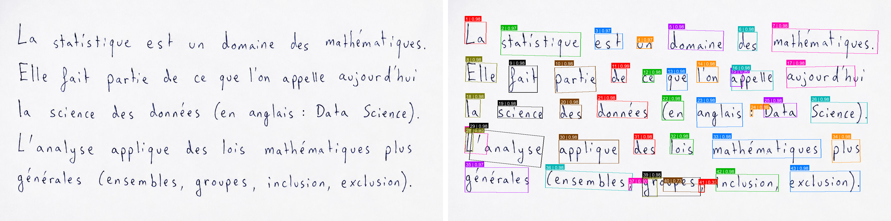

## Nemotron Detector

Windows-based detector-only wrapper for Nemotron OCR2 word and line detection.

It runs the detector checkpoint with plain PyTorch and can export:

- labeled image
- binary mask
- JSON with boxes, confidence scores, RBOX values, and reading-order labels
- paired debug image, original on the left and labeled result on the right

This repo does detection only. It does not run text recognition.

### Examples

Sample word detection (synthetic handwriting image):

<p>
  
</p>

### Install

From GitHub:

```bash
pip install git+https://github.com/Bin-2/nemotron-detector.git
```

For local development:

```bash
git clone https://github.com/Bin-2/nemotron-detector.git
cd nemotron-detector
pip install -e .
```

### Model files

The package expects the model files here:

```text
src/nemotron_detector/models/word/detector.safetensors
src/nemotron_detector/models/word/model_config.json

src/nemotron_detector/models/line/detector.safetensors
src/nemotron_detector/models/line/model_config.json
```

Legacy `detector.pth` files are also supported if placed in the same folders.

### Quick start

```python
from nemotron_detector import NemotronDetector

detector = NemotronDetector.from_variant("word")

result = detector.process(
    image_path=r"./image.png",
    output_dir=r"./outputs",
    save_labeled=True,
    save_mask=True,
    save_json=True,
    save_paired=True,
)

print(len(result["detections"]))
print(result["exports"])
```

Line detection:

```python
detector = NemotronDetector.from_variant("line")
```

Run both:

```bash
python examples/detect_both.py
```

Edit `IMAGE_PATH` in the example first.

### Output files

For input `page.png`, word detection creates:

```text
page_word_detected.png
page_word_mask.png
page_word_detections.json
page_word_paired.png
```

Line detection creates:

```text
page_line_detected.png
page_line_mask.png
page_line_detections.json
page_line_paired.png
```

### Notes

The detector uses portable Python post-processing. The reading order is a geometry-based heuristic.
